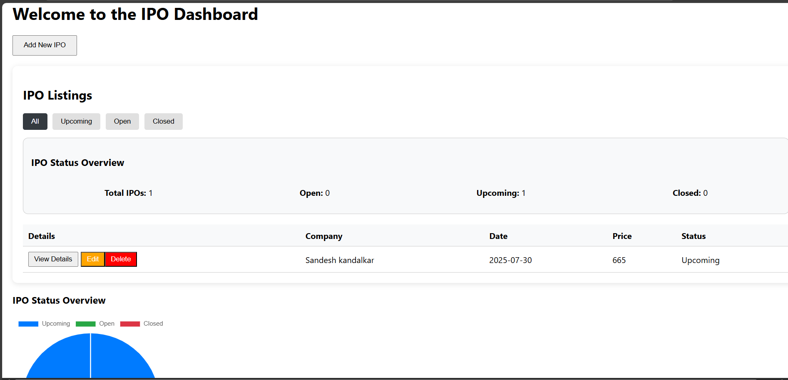

#  IPO Dashboard

A modern React-based dashboard to manage, add, edit, and track IPO listings using localStorage and interactive charts.

##  Features

- Add, edit, delete IPOs
- Filter IPOs by status (Upcoming, Open, Closed)
- ChartJS-based pie chart for visualizing IPO status
- Styled with clean CSS
- Data persistence with `localStorage`

##  Tech Stack

- React
- Chart.js
- JavaScript (ES6+)
- HTML/CSS (Responsive)
- localStorage API

##  Folder Structure
src/
|-components/
|   |-IPOChart.js
|   |-IPOList.js
|   |-IPOSummary.js
|   |-Navbar.js
|   |-Sidebar.js
|-pages/
|   |-AddIPO.js
|   |-Dashboard.js
|   |-EditIPO.js
|   |-IPODetails.js
|-utils/
|   |-ipoStorage.js
|--App.js
|--index.js


##  How to Run

1. Install dependencies:
   ```bash
   npm install

2. Start the development server:

    npm start

3. Open your browser and navigate to:

    http://localhost:3000

4. Make changes and see live updates in development mode.


## Screenshots



## Learnings

- State management with React
- Working with `localStorage`
- Using `Chart.js` in React
- Routing with `react-router-dom`

---

## Author

- **Your Name** — [GitHub Profile Link](https://github.com/yourusername)